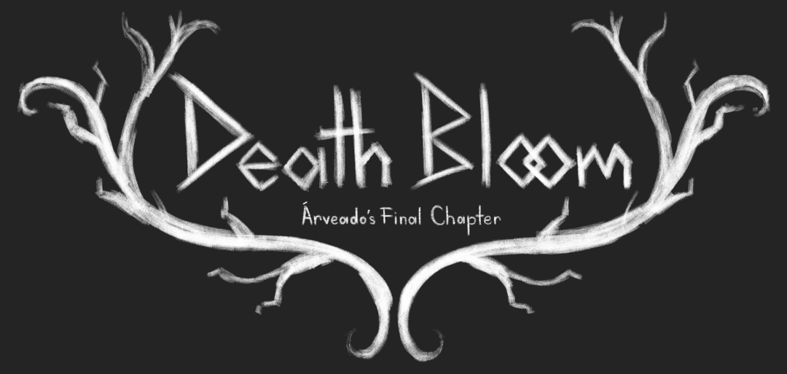
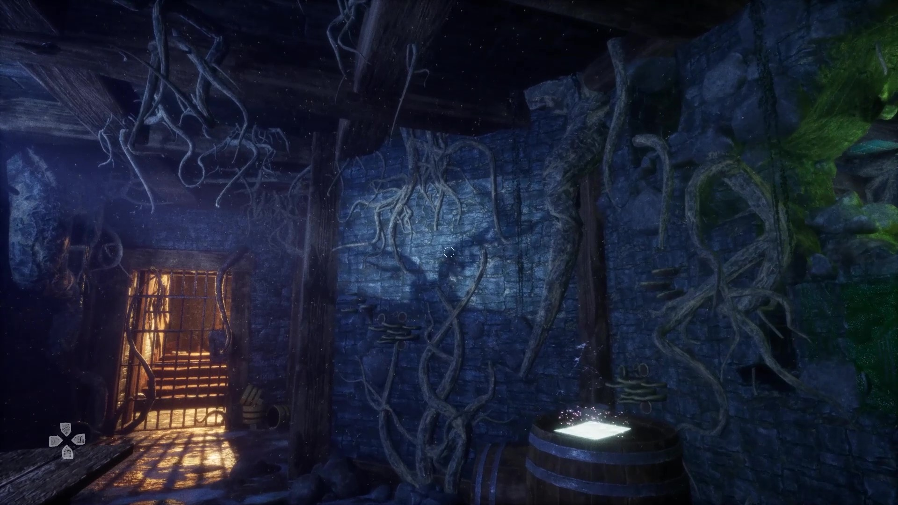
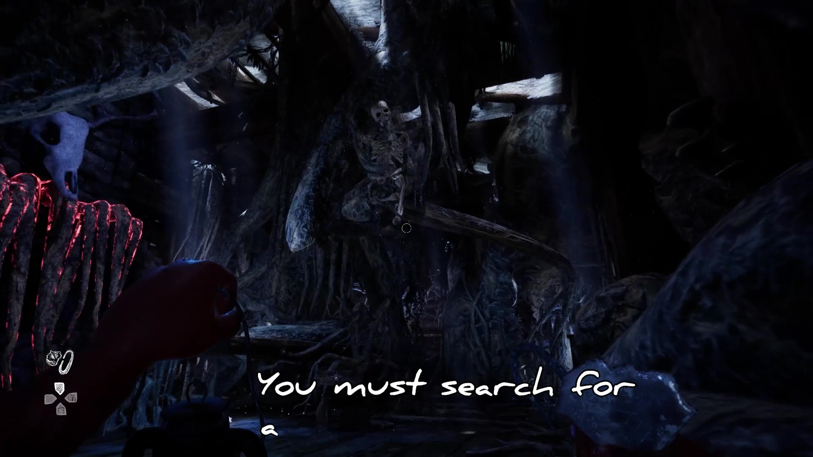
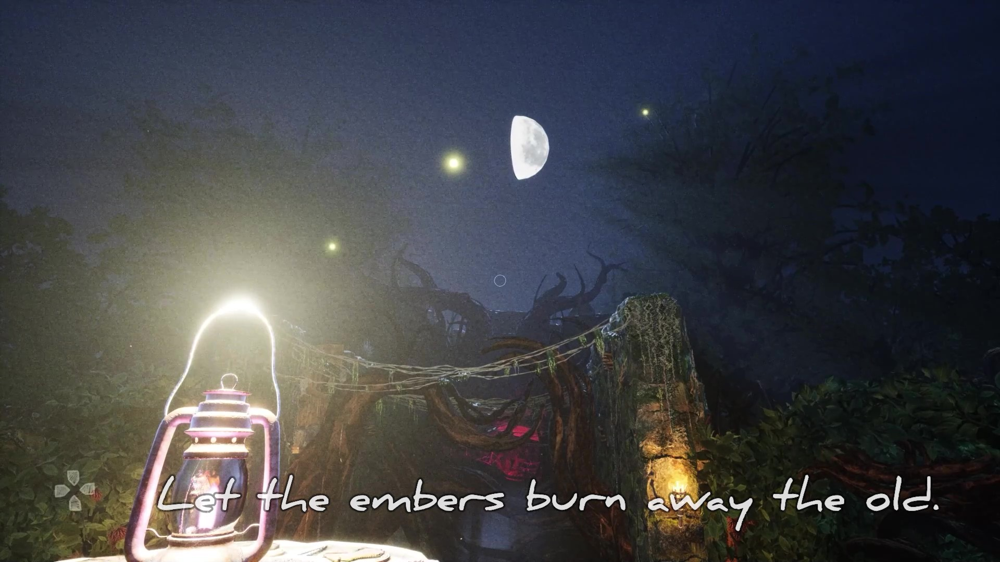
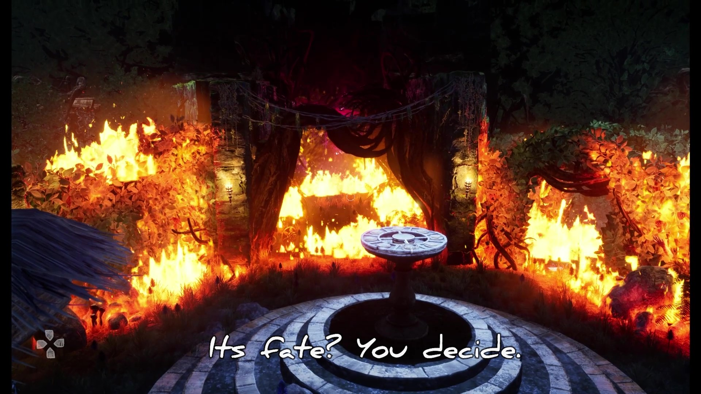

# Death Bloom

### [Presented by the ATEC Game Lab](https://atec-animgames.com/game-lab)

 

Survive a dark fairy tale where you must burn the heart of Arveado to survive the night. Using a storybook as your guide, find lost pages to learn the dark secrets of this mysterious forest dwelling and who lives inside.

Solve puzzles, investigate curious objects and journey deeper into a fantastical world of danger, but don’t look in the wrong places or your story may end too soon.

Available to play here: [Release Build](https://utdallas.box.com/shared/static/znctrxbf1vfkxxc84zft46e65z5hzo14.zip)

 

Game Screenshots

    

        
        
    

    

        
        
    

## The Team

### Production

- Calvin Steponaitis - Producer
- Adam Chandler - Director
- Tim Lewis - Director

### Art

- Benjamin Cressman - Art Lead
- Fatimeh Bashir - Art Production Manager
- Annie Wu - Concept Artist
- Rebecca Cisneros - Concept Artist
- Jihyoung Ham - 3D Artist
- Emily Willingham - 3D Artist
- Brennan Black - 3D Artist
- Shivang Patel - 3D Artist
- Ariana Mendez - 3D Artist
- Angelina Cook - 3D Artist
- Connor Dick - 3D Artist
- Kira Smith - Animation/Rigging
- Yajat Shirpurkar - Animation/Rigging
- Phu Le - Animation/Rigging/VFX/Modeling/Surfacing

### Design

- Macie Murphy - Design Lead
- N Roberts - Production Manager
- Tate Berry - Game Designer
- Joshua Hampton - Game Designer
- Wesley Pate - Game Designer
- Ian Guglielmi-White - Level Designer
- Maikhanh Ho - Level Designer
- Ian Percy - Level Designer
- Robin Lima - Narrative Designer
- Annabella Mays - Narrative Designer
- Rachel Kerr - Narrative Designer
- Aliya Lee - UI/UX Artist

### Programming

- Nick Maclean - Programming Lead
- Ally Duong - Production Manager
- Mikey Bess - Programmer
- Sai Kaushik Mangipudi - Programmer
- William Callihan - Programmer
- Daniel Martinez Murillo - Programmer
- Brandon Coffey - Programmer
- Tryston Minsquero - Programmer
- Jared Ellis - Programmer
- Muhammad Umer Qazi - Programmer
- Marc Soliman - Programmer

### Sound

- Lauren D'Angelo - Sound Lead
- Jack Vanzine - Production Manager
- Kem Echezona - Sound Designer
- Layla Weidenfeller - Sound Designer
- Kad Penney - Sound Designer

### Sound Lab

- Alan Yu
- Alex Champagne
- Alexis Roemer
- Austin Kasper
- Brandon Dobbs
- Cheyenne Vallier
- Jacob Masuno
- John Onomo
- Josh Rainey
- Julia Yu
- Kigen Shealy
- Rina Harrison
- Scott Bowes
- Travis Turner
- Wyatt Jarrell
