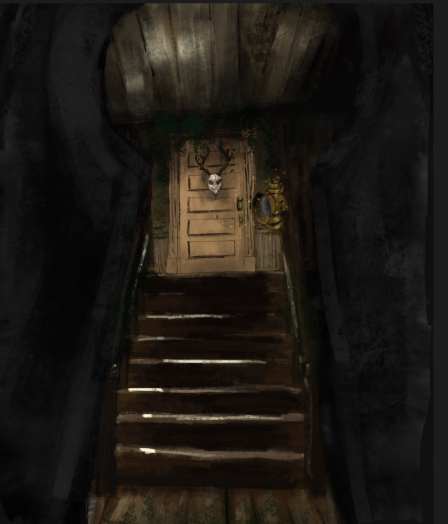

# Death Bloom: Árveado

### [Presented by the ATEC Game Lab](https://atec-animgames.com/game-lab)

 

Description

Available to play here: [Release Build]()

 

Concept Art

## The Team

### Production Team

- Calvin Steponaitis - Producer
- Adam Chandler - Director
- Tim Lewis - Director

### Art Team

- Benjamin Cressman - Art Lead
- Fatimeh Bashir - Art Production Manager
- Annie Wu - Concept Artist
- Rebecca Cisneros - Concept Artist
- Jihyong Hampton - 3D Artist
- Emily Willingham - 3D Artist
- Brennan Black - 3D Artist
- Shivang Patel - 3D Artist
- Ariana Mendez - 3D Artist
- Angelina Cook - 3D Artist
- Connor Dick - 3D Artist
- Kira Smith - Animation/Rigging
- Yajat Shirpurkar - Animation/Rigging
- Phu Le - VFX

### Design Team

- Macie Murphy - Design Lead
- N Roberts - Design Production Manager
- Tate Berry - Game Designer
- Joshua Hampton - Game Designer
- Wesley Pate - Game Designer
- Ian Guglielmi-White - Level Designer
- Maikhanh Ho - Level Designer
- Ian Percy - Level Designer
- Robin Lima - Narrative Designer
- Annabella Mays - Narrative Designer
- Rachel Kerr - Narrative Designer
- Aliya Lee - UI/UX Artist

### Programming Team

- Nick Maclean - Programming Lead
- Ally Duong - Programming Production Manager
- Michael Bess - Programmer
- Sai Kaushik Mangipudi - Programmer
- William Callihan - Programmer
- Daniel Martinez Murillo - Programmer
- Brandon Coffey - Programmer
- Tryston Minsquero - Programmer
- Muhammad Qazi - Programmer
- Jared Ellis - Programmer
- Marc Soliman - Programmer

### Sound Team

- Lauren D'Angelo - Sound Lead
- Jack Vanzine - Sound Production Manager
- Nkemdilim Echezona - Sound Designer
- Layla Weidenfeller - Sound Designer
- Kad Penney - Sound Designer
